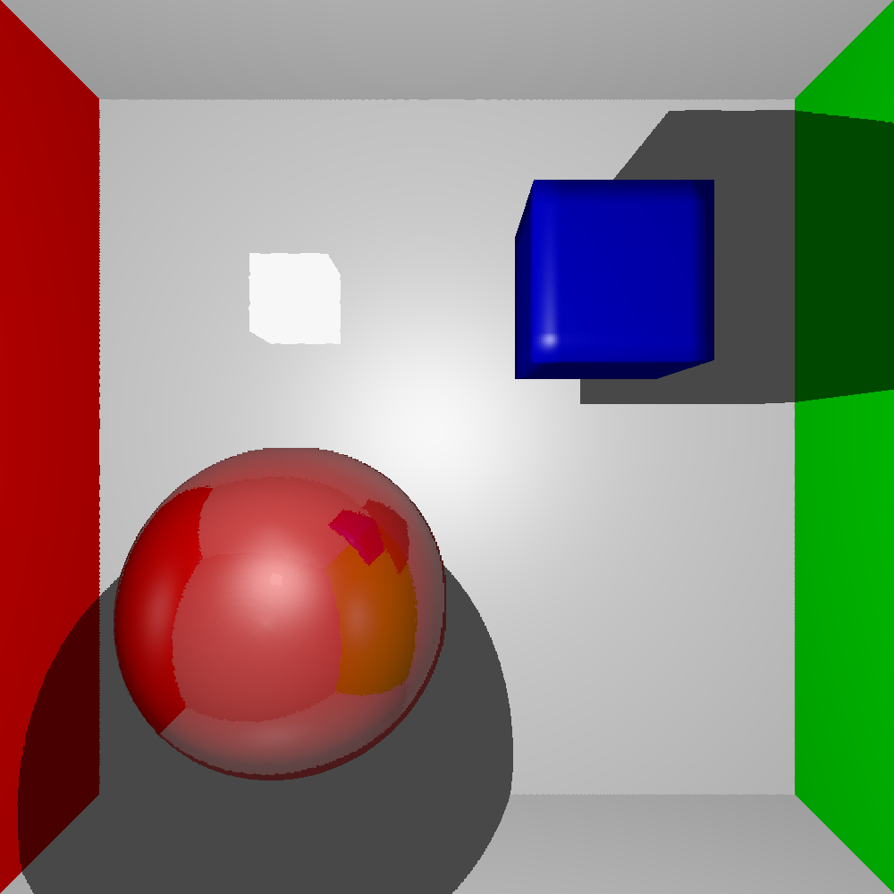

# Binary Volume Ray Tracer
CPU rendering of a binary volume with ray tracing.
### Dependencies
1. [Optional] Install OpenMP library to enable parallel computation.  
2. [Optional] Install SDL2 library to view rendered image in a window and be able to use interactive mode (with low resolution).  

### Results
  
You can view the resulting render with a ppm viewer such as [this](https://www.cs.rhodes.edu/welshc/COMP141_F16/ppmReader.html).
